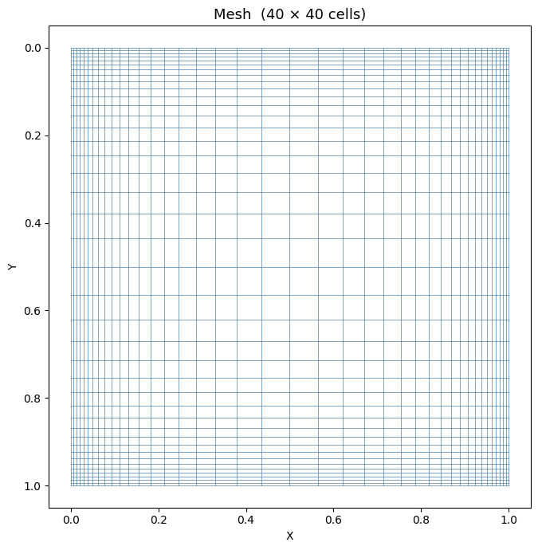
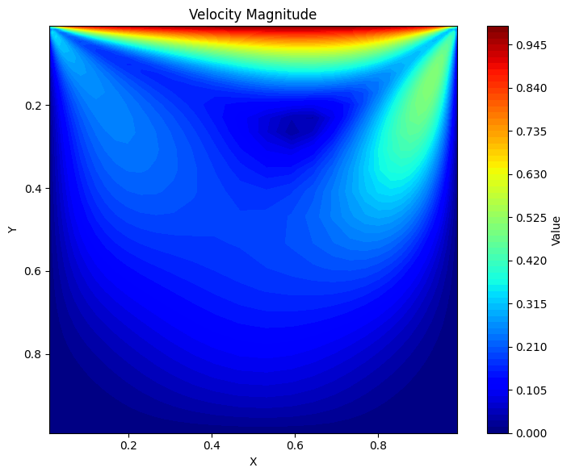
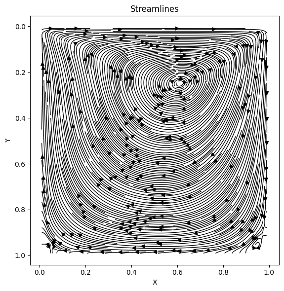

# Taiho-CFD：二维不可压缩 Navier-Stokes 求解器

基于有限体积法（FVM）和 SIMPLE 算法的二维不可压缩 Navier-Stokes 方程 MPI 并行求解器，支持定常与非定常两种计算模式。

---

## 目录

- [功能特性](#功能特性)
- [项目结构](#项目结构)
- [依赖环境](#依赖环境)
- [编译](#编译)
- [网格生成](#网格生成)
- [运行](#运行)
- [边界条件说明](#边界条件说明)
- [网格文件格式](#网格文件格式)
- [后处理](#后处理)
- [算法说明](#算法说明)
- [示例：顶盖驱动方腔流](#示例顶盖驱动方腔流)

---

## 功能特性

- **SIMPLE 算法**：压力速度耦合，支持松弛因子调节
- **定常 / 非定常**：分别对应 `solver_simple_steady` 和 `solver_simple_unsteady`
- **MPI 并行**：沿 x 方向域分解，ghost 层自动交换
- **二维正交结构网格**：支持坐标方向的非均匀拉伸，几何量自动计算
- **匹配矩阵性质的线性求解器**：非对称动量方程使用 BiCGSTAB+ILUT，压力修正使用 PCG+不完全 Cholesky
- **多种边界条件**：无滑移壁面、速度入口、压力出口、并行接口层
- **物理收敛检测**：同时检查全局质量不平衡和速度场相对变化

---

## 项目结构

```
.
├── src/
│   ├── mesh/                        # 网格、patch 和逐字段边界条件
│   ├── numerics/                    # FVM 算子、离散格式、Rhie-Chow 和压力修正
│   ├── solvers/                     # SIMPLE、求解控制、BiCGSTAB 和 PCG
│   ├── parallel/                    # 域分解与 halo 交换
│   ├── io/                          # 网格读取与结果输出
│   └── apps/                        # 共用运行循环及两个轻量入口
├── Makefile
├── gen.ipynb                    # 顶盖方腔网格生成脚本（示例）
└── plot.ipynb                   # 后处理与可视化脚本
```

---

## 依赖环境

| 依赖 | 版本要求 | 说明 |
|------|----------|------|
| MPI  | 任意标准实现（OpenMPI / MPICH） | 并行通信 |
| Eigen | ≥ 3.4 | 稀疏矩阵与线性代数 |
| C++ 编译器 | 支持 C++17 | `std::filesystem` 等 |
| Python 3 | ≥ 3.8（后处理可选） | numpy / matplotlib / scipy |

Ubuntu / Debian 安装示例：

```bash
sudo apt install libopenmpi-dev libeigen3-dev
pip install numpy matplotlib scipy
```

---

## 编译

```bash
make          # 同时编译定常与非定常求解器
make clean    # 清理构建产物
```

编译成功后生成两个可执行文件：

```
solver_simple_steady
solver_simple_unsteady
```

---

## 网格生成

使用 `gen.ipynb`（以顶盖驱动方腔为例）生成所需网格文件：

```bash
python gen.ipynb
```

脚本会在 `ldc_exp/` 目录下生成以下文件（详见[网格文件格式](#网格文件格式)）：

```
ldc_exp/
├── params.txt     # 网格尺寸
├── x.dat          # 节点 x 坐标  (ny+1)×(nx+1)
├── y.dat          # 节点 y 坐标  (ny+1)×(nx+1)
├── bctype.dat     # 边界类型     ny×nx
├── zoneid.dat     # 区域编号     ny×nx
└── zoneuv.txt     # 各区域速度值
```

可调整的参数：

```python
generate_lid_driven_cavity(
    nx=100, ny=100,       # 网格分辨率
    Lx=1.0, Ly=1.0,       # 计算域尺寸
    lid_u=1.0, lid_v=0.0, # 顶盖速度
    alpha_x=5.0,          # x 方向拉伸系数（越大壁面越密）
    alpha_y=5.0,          # y 方向拉伸系数
    output_dir="ldc_exp",
)
```

---

## 运行

### 定常求解器

```bash
# 命令行传参
mpirun -np <进程数> ./solver_simple_steady <网格文件夹> <迭代步数> <动力粘度>

# 示例：4 进程，最多 500 步，Re=100（mu=0.01）
mpirun -np 4 ./solver_simple_steady ldc_exp 500 0.01

```

### 非定常求解器

```bash
# 命令行传参
mpirun -np <进程数> ./solver_simple_unsteady <网格文件夹> <时间步长dt> <总时间步数> <动力粘度>

# 示例：4 进程，dt=0.01，共 200 步，Re=100
mpirun -np 4 ./solver_simple_unsteady ldc_exp 0.01 200 0.01
```

> **注意**：MPI 进程数必须与程序内部网格分割数完全一致（程序自动读取 `MPI_Comm_size`）。

### 关键求解参数（在源码中调整）

| 参数 | 默认值 | 说明 |
|------|--------|------|
| `pressure_relaxation` | 0.3 | 压力松弛因子 |
| `velocity_relaxation` | 0.5（稳态）/ 0.7（非稳态） | 动量松弛因子 |
| `velocity.relative_tolerance` | 1e-7 | 动量方程相对残差容差 |
| `pressure.relative_tolerance` | 1e-7 | 压力方程相对残差容差 |
| `velocity.max_iterations` | 200 | 动量 BiCGSTAB 最大迭代次数 |
| `pressure.max_iterations` | 1000 | 压力 PCG 最大迭代次数 |
| `simple.residual.continuity` | 1e-7 | 全局连续性收敛容差 |

---

## 边界条件说明

当前算例文件仍兼容原有 `bctype.dat/zoneid.dat/zoneuv.txt`。读取器会把
legacy 整数编码转换成几何 patch，并分别生成速度场 `U` 和压力场 `p`
的边界条件；求解核心不再直接判断这些整数。

| 值 | 类型 | 说明 |
|----|------|------|
| `0` | 内部点 | 参与方程求解 |
| `> 0`（如 `1`） | wall patch | `U=fixedValue/noSlip`，`p=zeroGradient` |
| `-1` | pressure outlet patch | `U=zeroGradient`，`p=fixedValue(0)` |
| `-2` | velocity inlet patch | `U=fixedValue`，`p=zeroGradient` |
| `-3` | legacy processor 标记 | 正常算例不应设置；MPI 分解会生成独立 `Processor` 拓扑 |

边界模型支持 `FixedValue`、`ZeroGradient`、`InletOutlet` 和 `NoSlip`。
压力固定值保存在压力场条件中，因此不再局限于零表压。几何 patch、
字段边界条件和 MPI processor 拓扑相互独立。

---

## 网格文件格式

### `params.txt`
```
<nx> <ny>
```

### `x.dat` / `y.dat`
形状为 `(ny+1) × (nx+1)` 的节点坐标矩阵，行优先存储。

### `bctype.dat` / `zoneid.dat`
形状为 `ny × nx` 的整数矩阵，行优先存储。

### `zoneuv.txt`
每行对应一个 zone 的 `(u, v)` 速度，行号即 `zoneid` 值：
```
0.0  0.0    # zone 0：静止壁面
1.0  0.0    # zone 1：顶盖，u=1
```

---

## 后处理

计算结束后，每个 MPI 进程会输出以下文件（`<rank>` 为进程编号）：

```
u_<rank>.dat    # x 方向速度
v_<rank>.dat    # y 方向速度
p_<rank>.dat    # 压力场
xc_<rank>.dat   # 单元中心 x 坐标
yc_<rank>.dat   # 单元中心 y 坐标
```

每个文件只包含该 rank 拥有的真实列，不包含 ghost 列；按 rank 从小到大沿列拼接即可恢复全局场。

运行后处理脚本将各进程结果拼接并可视化：

```bash
python postprocess.py
# 输入提示：请输入子进程数量 - 1（例如并行4个进程则输入3）
```

脚本将输出：
- `u/v/p/xc/yc_combined.dat`：拼接后的全局场数据
- 速度幅值云图
- 压力云图
- 流线图

---

## 算法说明

求解器采用经典 **SIMPLE**（Semi-Implicit Method for Pressure-Linked Equations）算法，每次迭代包含以下步骤：

```
1. 离散动量方程  →  求解 u*, v*（预测速度）
2. Rhie-Chow 动量插值  →  计算面速度 u_face, v_face
3. 构建压力修正方程  →  求解 p'
4. 修正压力  p = p* + α_p · p'
5. 修正速度  u* ← u* + f(p')
6. 收敛判断（全局质量不平衡 + 速度场相对变化）
```

有定压出口时，压力修正采用固定值 `p'=0` 并将边界系数加入方程对角项；没有定压出口的闭域只设置一个参考压力单元。并行策略采用沿 x 方向的**域分解**，相邻子域间各设置 2 层 `Processor` ghost 单元，通过 `MPI_Sendrecv` 交换连续列缓冲区。

稳态和非稳态共用同一个 SIMPLE 循环。动量方程由四个显式有限体积
算子组成：`addDdt`、`addConvection`、`addLaplacian` 和
`addPressureGradient`，最后统一应用速度方程松弛。

当前 `NumericalSchemes` 明确限定为：

| 项 | 格式 |
|----|------|
| 时间项 | `steadyState` 或一阶 `backwardEuler` |
| `div(phi,U)` | 一阶 `upwind` |
| `grad(p)` | 单元中心 `central` |
| `laplacian(mu,U)` | 两点 `orthogonal` |
| 面速度插值 | `linear` + Rhie-Chow 修正 |

离散方式由 `NumericalSchemes` 管理；线性求解器、预条件器、绝对/相对
容差由 `SolutionConfig` 管理；SIMPLE迭代、松弛和收敛条件由
`SimpleControl` 管理。未实现的格式或求解器组合会在启动时明确拒绝。

数值装配回归测试可通过 `make test` 执行：压力测试覆盖压力出口
Dirichlet 对角项和闭域单参考压力；动量测试验证时间项和四算子组合；
边界测试验证 legacy 转换、逐字段条件、非零固定压力和 MPI processor
拓扑。

可运行 `make test-pressure` 回归检查定压出口对角项、闭域参考压力、压力矩阵对称性和 PCG 收敛。

---

## 示例：顶盖驱动方腔流

```bash
# 1. 生成 100×100 拉伸网格
python gen.ipynb

# 2. 使用 4 进程定常求解，Re=100
mpirun -np 4 ./solver_simple_steady ldc_exp 1000 0.01

# 3. 后处理与可视化（4进程，输入3）
python plot.ipynb
```

预期结果：中心处出现主涡，四角出现次级涡，与 Ghia et al. (1982) 基准解吻合。
## 示例：顶盖驱动方腔流结果 Re=100

### 网格



### 速度场


### 流线


